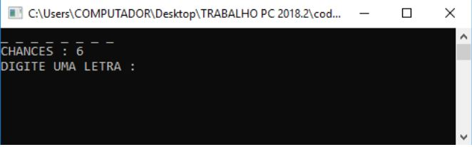
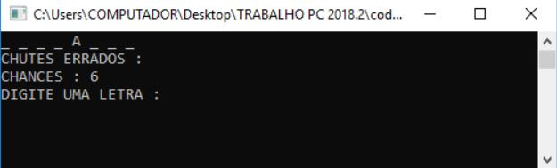
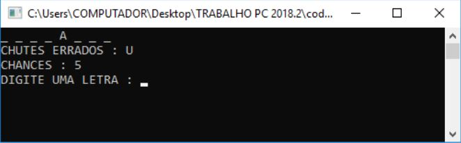
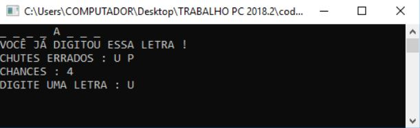
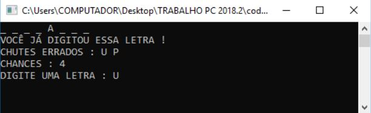

<h1>Jogo da Forca em C 🎮<h1>
<h3> - Projeto criado para a disciplina de Programação computacional no curso de Engenharia da Computação UFC com a colaboração de Icaro Prado Vasconcelos <h3>

<h2>Descrição<h2>

 O jogo da forca é um jogo em que o jogador tem que acertar qual é a palavra proposta, tendo como dica o número de letras da palavra. A cada letra errada, é descontada
uma unidade das chances (No total 6 chances). O jogo termina ou com o acerto da palavra ou com o término de chances disponíveis. 

<h2>Tela Inicial<h2>

Na tela inicial é exibido a quantidade de letras que a palavra proposta tem e pede para o usuário digitar (chutar) uma possível letra da palavra proposta.

<h2>Acerto de Letra<h2>

Caso o usuário acerte uma letra da palavra proposta, a letra imediatamente é alocada a sua devida posição na palavra. (Neste exemplo o usuário digitou letra A).

<h2>Erro de Letra<h2>

Caso o usuário chute uma letra que não está presente na palavra proposta, a letra errada é adicionada ao conjunto de chutes errados. (Usuário chutou a letra U).

<h2>Chute Repetido<h2>

Quando o usuário inserir uma letra já digitada antes, o programa irá alertá-lo e não haverá desconto no número de chances.

<h2>Acerto de Palavra<h2>

